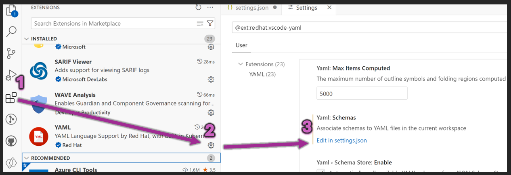

   [](https://dev.azure.com/dynamicscrm/OneCRM/_build/latest?definitionId=21051&branchName=master)

# Power Apps tools for professional developers
- 🆕 C#/.Net library for working with Power Apps msapp files
- Legacy Source File Pack and Unpack Utility (PASopa)

> [!TIP]
> We welcome feedback on the project, file format, and capabilities. Start [discussion or vote for ideas](https://github.com/microsoft/PowerApps-Tooling/discussions?discussions_q=is%3Aopen+sort%3Atop)


## Prerequisites
- [VS 2022](https://visualstudio.microsoft.com/downloads/) or [VSCode](https://code.visualstudio.com/Download)
- [YAML Language Support by Red Hat](https://marketplace.visualstudio.com/items?itemName=redhat.vscode-yaml) (recommended)

## Usage
- Configure VSCode YAML extension to use the schema file in the repo. Add the following to your settings.json:

```json
"yaml.schemas": {
    "https://raw.githubusercontent.com/microsoft/PowerApps-Tooling/master/docs/pa.yaml-schema.json": "*.pa.yaml" 
}
```

- For advamced C#/.Net library usage, please explore the [Microsoft.PowerPlatform.PowerApps.Persistence](https://github.com/microsoft/PowerApps-Tooling/tree/master/src/Persistence) library.

## Contributing

We welcome feedback on the design, file format, and capabilities. Comments and issues are very welcome.

Most contributions require you to agree to a Contributor License Agreement (CLA) declaring that you have the right to, and actually do, grant us the rights to use your contribution. For details, visit [https://cla.opensource.microsoft.com](https://cla.opensource.microsoft.com).

Before making a Pull Request, please file an Issue and solicit discussion.

When you submit a pull request, a CLA bot will automatically determine whether you need to provide
a CLA and decorate the PR appropriately (e.g., status check, comment). Simply follow the instructions
provided by the bot. You will only need to do this once across all repos using our CLA.

This project has adopted the [Microsoft Open Source Code of Conduct](https://opensource.microsoft.com/codeofconduct/).
For more information see the [Code of Conduct FAQ](https://opensource.microsoft.com/codeofconduct/faq/) or
contact [opencode@microsoft.com](mailto:opencode@microsoft.com) with any additional questions or comments.

### Setting up a dev box

For a developer machine (Windows 10, WSL, Linux, macOS), install:

- [git](https://git-scm.com/downloads)
- [.NET Core SDK v6.0.x (x64)](https://dotnet.microsoft.com/en-us/download/dotnet/6.0)
- [VS Code](https://code.visualstudio.com/Download)
- if on Windows: [VS2019 or VS2022 (Community edition will do)](https://visualstudio.microsoft.com/downloads/).  Select at least the following workload: .NET Core cross-plat
- recommended VSCode extensions:
  - [GitLens (eamodio.gitlens)](https://github.com/eamodio/vscode-gitlens)
  - [C# (ms-vscode.csharp)](https://github.com/OmniSharp/omnisharp-vscode)

### Building and running tests

After cloning this repo (https://github.com/microsoft/PowerApps-Language-Tooling), open a terminal/cmd/PS prompt with the dotnet executable on the path. Check with: ```dotnet --version ```

To build, run tests and produce nuget packages, run this command:

```bash
./build ci
```

To list all build targets, run: ```./build --list-tree```

To see other build help, run: ```./build --help```
