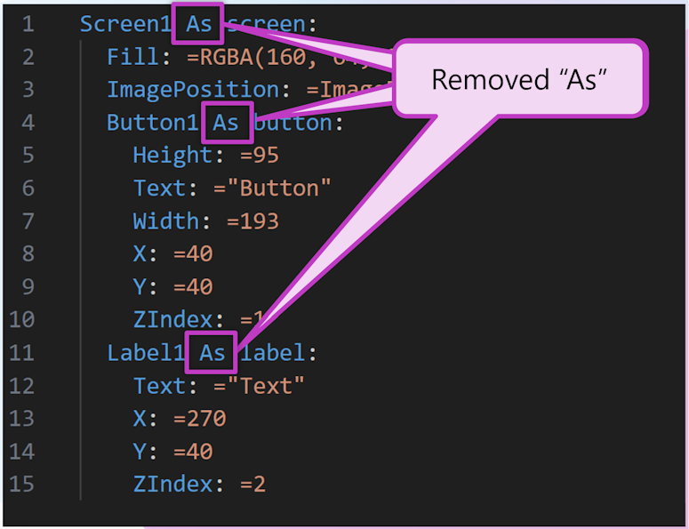
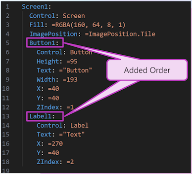
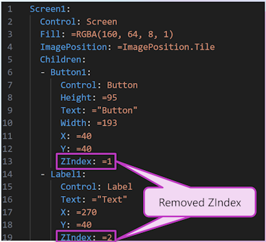

# Changes to YAML file format generated by PASopa

The Power Apps Source Packager (PASopa) generates a YAML file format decribed in [YAMLFileFormat.md](YAMLFileFormat.md). This document outlines changes to the format that have been made to improve readability and source control experience. 

## Removed "As" operator
"As" operator is replaced with a separate line `Control: Button` for example. This is to make the format more readable and to avoid the need to escape the colon in the name of the control.



## Added ordering of controls
Controls are ordered in the order they appear in the source file.



## Removed ZIndex
ZIndex is removed from the format to reduce noise in the source files. ZIndex is not a common property that is modified by the app maker and is not needed in the source files.



# Final format
```yaml
Name of Some Control:
    Control: Button
    Properties:
        Fill: =RGBA(250, 250, 250, 1)
        Width: =Parent.Width
        Height: =Parent.Height
        PaddingBottom: =16
        PaddingLeft: =16
        PaddingRight: =16
        PaddingTop: =16
      Children:
      - Name of Child Control:
          Control: Label
          Properties:
              Text: ="Hello, Power Apps!"
              Fill: =RGBA(0, 0, 0, 1)
              Width: =Parent.Width
              Height: =Parent.Height
              PaddingBottom: =16
              PaddingLeft: =16
              PaddingRight: =16
              PaddingTop: =16
```