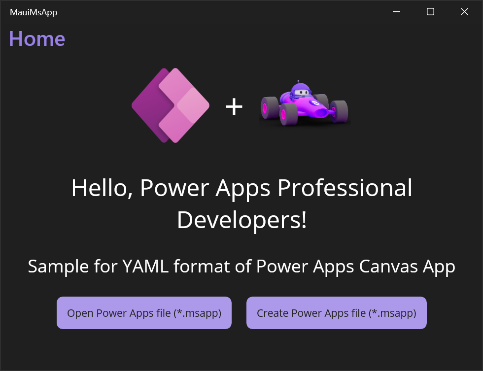
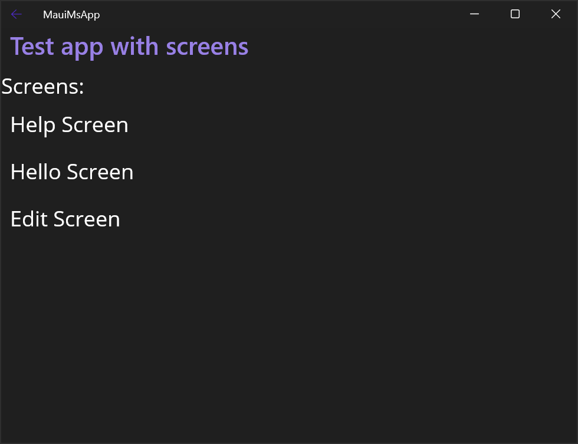

# Samples for Power Apps

Samples for creating, reading, and updating files containing Power Apps (*.msapp)

## Prerequisites
- .NET 8.0
- Visual Studio 2022
- MAUI workload (note: may require install through the Visual Studio installer)

## Getting Started
- First build the PASopa Solution prior to building the samples.

### Test.AppWriter
- To build the Test.AppWriter, you may build through Visual Studio or on commandline with `dotnet build` in the root Test.AppWriter folder
- To run the Test.AppWriter to generate MSApp files, the exe should be located in `\Test.AppWriter\bin\Debug\net8.0`. Invoke the exe from the commandline with no arguments for a list of commands, or invoke a specific command for a list of specific options for that command.
Commandline arguments can also be supplied in Visual Studio debugger in the debug profile properties.
- A typical usage may look something like:
`.\Test.AppWriter.exe create --filepath my\output\path --numscreens 2 --controls Button Label`

### MAUI App
- To build the Test.AppWriter, you may build through Visual Studio or on commandline with `dotnet build` in the root Test.AppWriter folder

## Screenshots
MauiMsApp sample app shows how to open and create MsApp files using `Microsoft.PowerPlatform.PowerApps.Persistence` library.

List of screens in the MsApp file:

## Potential Errors
If you see the following Error:
"The project doesn't know how to run the profile with the name 'Windows Machine' and command 'MsixPackage'."
ensure that you have '.NET Multi-platform App UI development' installed through Visual Studio.